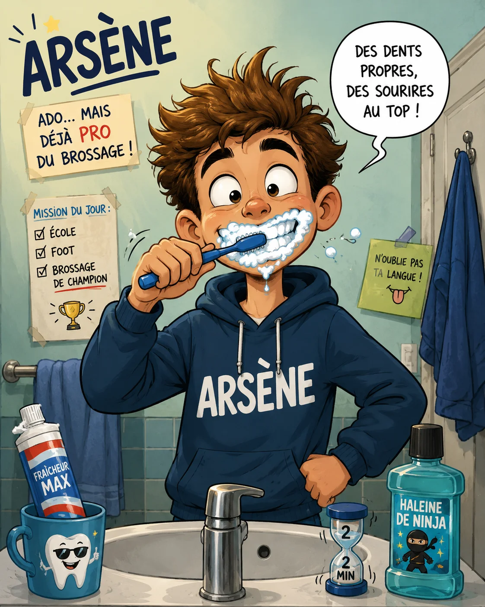

Je me souviens exactement du moment où je suis tombé amoureux de la F1. J'avais 10 ans, mon père regardait le GP de Monaco sur la télé du salon, et j'ai vu une monoplace frôler les glissières à 280 km/h dans le tunnel. Depuis ce jour, je n'ai plus décroché.

Aujourd'hui j'ai 16 ans et je regarde absolument **tous** les Grands Prix, même ceux qui commencent à 2h du matin à cause du décalage horaire. Ma mère dit que je suis fou. Elle a sûrement raison.

Ce qui me fascine le plus, c'est pas juste la vitesse. C'est la stratégie. Pendant les courses, je suis sur mon téléphone à suivre les temps au tour, à essayer de comprendre pourquoi une écurie garde son pilote en piste trois tours de plus avant de le rentrer aux stands. Ce moment où la stratégie fait basculer une course, c'est meilleur que n'importe quel film.

J'ai aussi un pilote préféré évidemment. Je ne vais pas vous faire croire que je suis objectif — personne ne l'est en F1. Ce que j'admire chez les grands champions, c'est leur capacité à trouver les limites d'une voiture imparfaite et à en tirer le maximum. Senna faisait ça. Schumacher aussi. Et les meilleurs d'aujourd'hui continuent.

Ce que peu de gens réalisent, c'est à quel point le vélo de course et la F1 se ressemblent dans la tête. Dans les deux sports, tu souffres, tu calcules, tu gères ton effort. Sur mon vélo dans les côtes, je pense souvent à ça — la gestion, l'anticipation, le bon moment pour attaquer.

Ce blog, c'est mon espace pour parler de tout ça. La F1, le vélo, et la vie d'un ado qui pédale et qui rêve.

